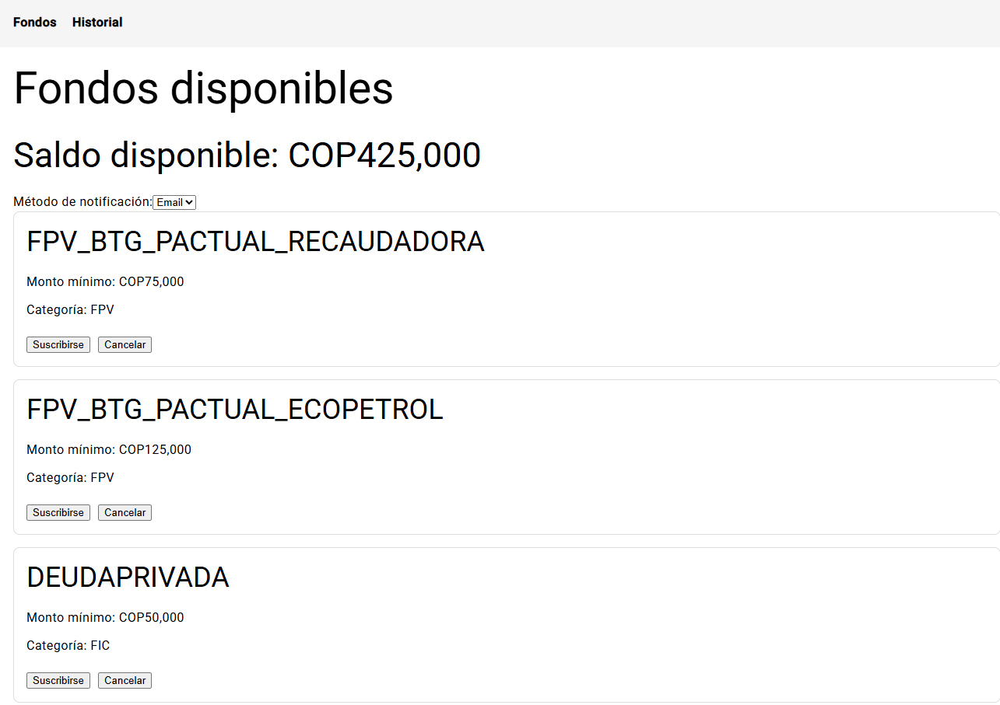
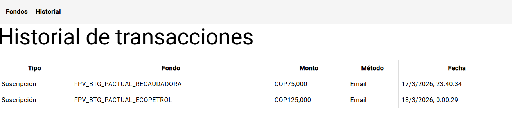
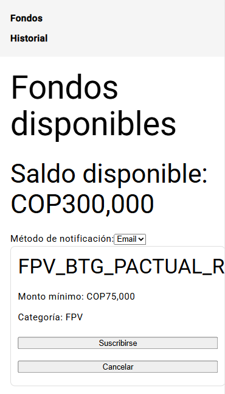

# BTG Fondos Frontend

Aplicación web desarrollada en Angular para la gestión de fondos de inversión (FPV / FIC), permitiendo a un usuario administrar sus suscripciones, cancelaciones y visualizar el historial de transacciones.

---

# Tecnologías utilizadas

* Angular 18
* TypeScript
* Angular Material
* RxJS
* JSON Server (Mock API)
* CSS Responsive Design

---

# Funcionalidades implementadas

## Gestión de fondos

* Visualización de fondos disponibles
* Validación de monto mínimo para suscripción
* Cancelación de participación en fondos
* Actualización automática de saldo

## Historial de transacciones

* Registro de suscripciones
* Registro de cancelaciones
* Fecha de operación
* Método de notificación seleccionado

## Notificaciones

* Selección de Email o SMS al suscribirse
* Feedback visual mediante Snackbar

## Responsive Design

* Adaptado para escritorio
* Adaptado para dispositivos móviles

---

# Saldo inicial del usuario

COP $500.000

---

# Fondos disponibles

| ID | Nombre                      | Monto mínimo | Categoría |
| -- | --------------------------- | ------------ | --------- |
| 1  | FPV_BTG_PACTUAL_RECAUDADORA | COP $75.000  | FPV       |
| 2  | FPV_BTG_PACTUAL_ECOPETROL   | COP $125.000 | FPV       |
| 3  | DEUDAPRIVADA                | COP $50.000  | FIC       |
| 4  | FDO-ACCIONES                | COP $250.000 | FIC       |
| 5  | FPV_BTG_PACTUAL_DINAMICA    | COP $100.000 | FPV       |

---

# Ejecución del proyecto

## Instalar dependencias

```bash
npm install
```

## Ejecutar aplicación Angular

```bash
ng serve
```

## Ejecutar mock API

```bash
json-server --watch db.json --port 3000
```

---

# URL de acceso

Frontend:

```bash
http://localhost:4200
```

Mock API:

```bash
http://localhost:3000/funds
```

---

# Estructura del proyecto

```plaintext
src/
 ├── app/
 │   ├── components/
 │   ├── pages/
 │   ├── services/
 │   ├── models/
 │   └── app.routes.ts
 ├── assets/
```

---

# Capturas de pantalla

## Dashboard principal



---

## Historial de transacciones



---

## Responsive móvil



---

# Posibles mejoras futuras

* Persistencia real en backend
* Autenticación de usuario
* Filtros avanzados en historial
* Exportación de movimientos

---

# Autor
Jhon Fredy Lopez
Desarrollado como prueba técnica Front-End.
